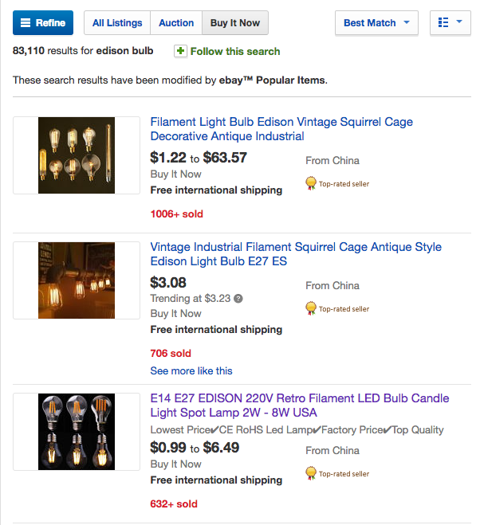

# eBay™ Popularity Sort

A firefox extension that sorts the eBay™ search results by popularity (number of times sold).

> Note: This extension is not officially endorsed by eBay™.
> This extension has been updated to unmodified Jquery 3.3.1 as per firefox request.

# Preview

# Usage

1. Install the extension from Firefox web store
2. Search eBay for something ([edison bulb](http://www.ebay.com/sch/i.html?LH_BIN=1&_from=R40&_sacat=0&_sop=12&_nkw=edison+bulb&_ipg=200&rt=nc)) and make sure `Buy It Now` and `Best Match` are selected
3. Scroll down to bottom of page and set `Items per page` to `200` for this to work better

Enjoy search results sorted by popularity!

I have forked and made changes to allow compatibility with firefox.

## License

[Apache 2.0](LICENSE)
